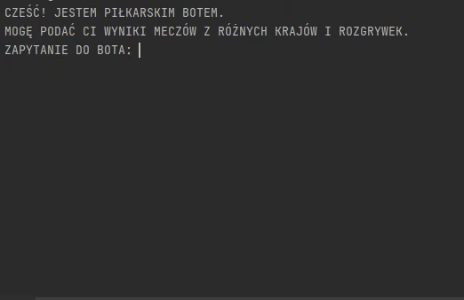

# Football chatbot ⚽
Check results of the match of nearly any period of 
time from many different countries in a quick way.
Bot is available only in Polish language.

## API
Bot is connected to https://www.football-data.org/ API. <br>
See the API documentation: https://www.football-data.org/documentation/quickstart

## Get started
To install dependencies use:
`pip install football-data-api`
`pip install python-aiml`

To get started you need API key, available for free here: https://www.football-data.org/client/register <br>
Do not forget to change your environmental variables:
`PYTHONUNBUFFERED=1;FOOTBALL_DATA_API=YOUR_GENERATED_KEY`

## Overwiew

Full list of available questions to bot:
```           
- WYSWIETL DOSTEPNE KRAJE
- WYSWIETL DOSTEPNE ROZGRYWKI
- WYBIERAM KRAJ (KRAJ)
- WYBIERAM ROZGRYWKI (ROZGRYWKI)
- PODAJ MECZE OD (DD MM RRRR) DO (DD MM RRRR) Z KRAJU
- PODAJ MECZE OD (DD MM RRRR) DO (DD MM RRRR) Z ROZGRYWEK
```


### Example questions

